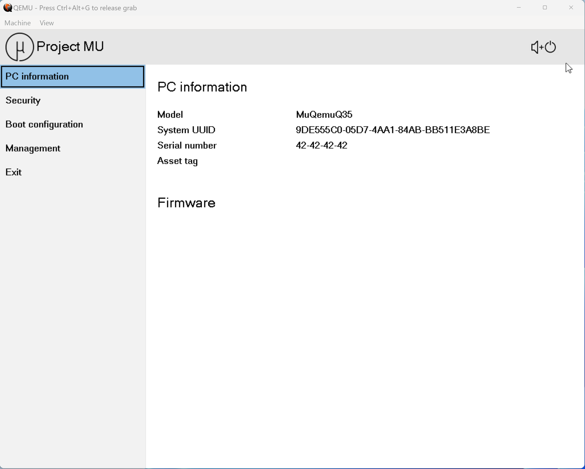
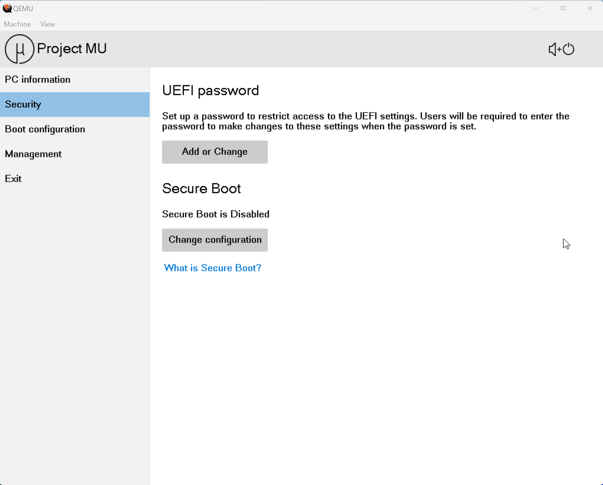
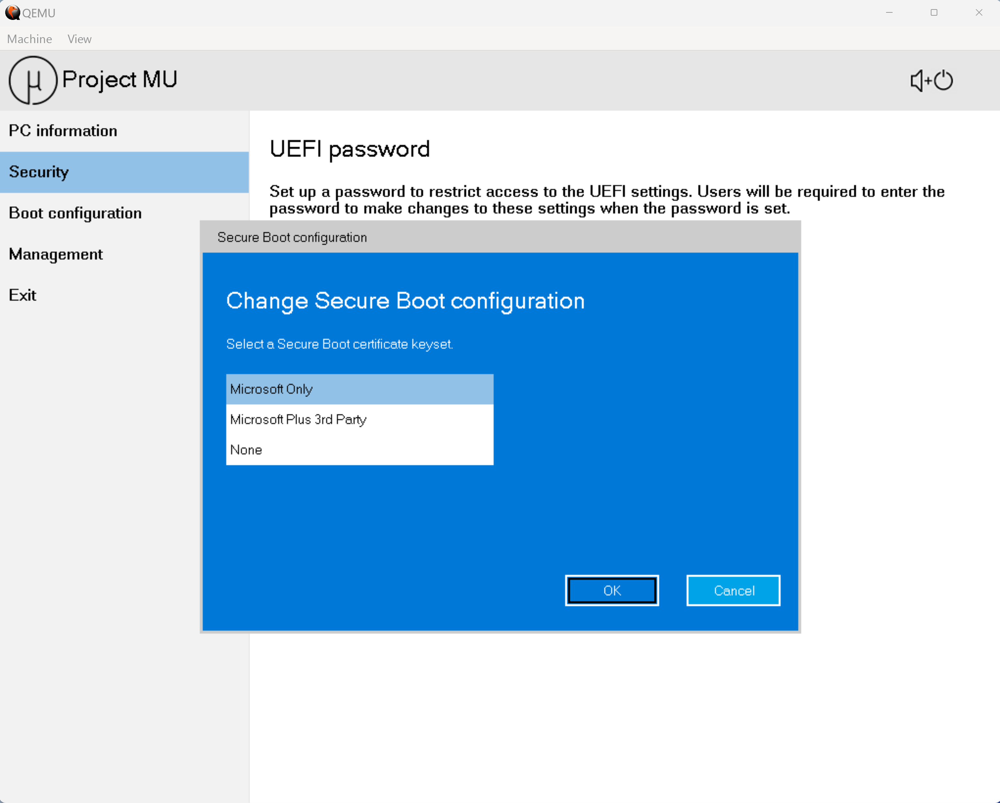
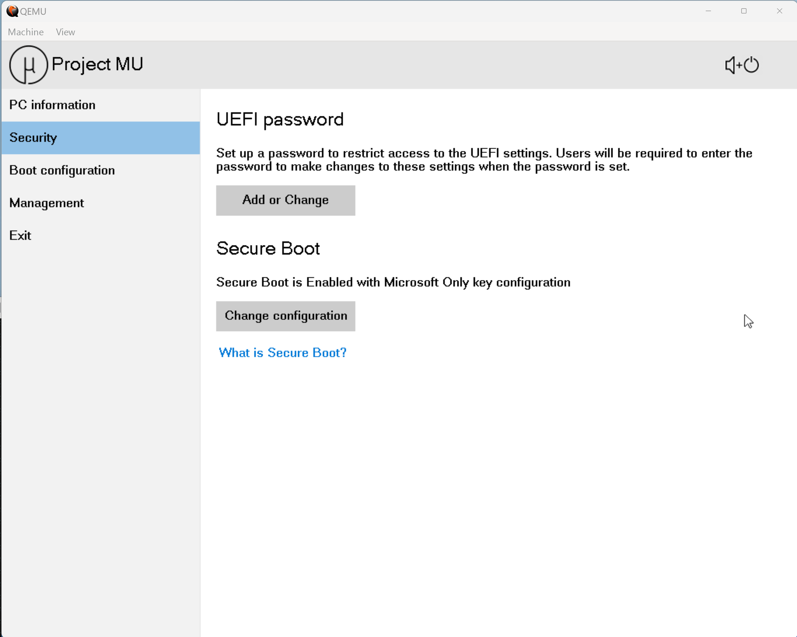
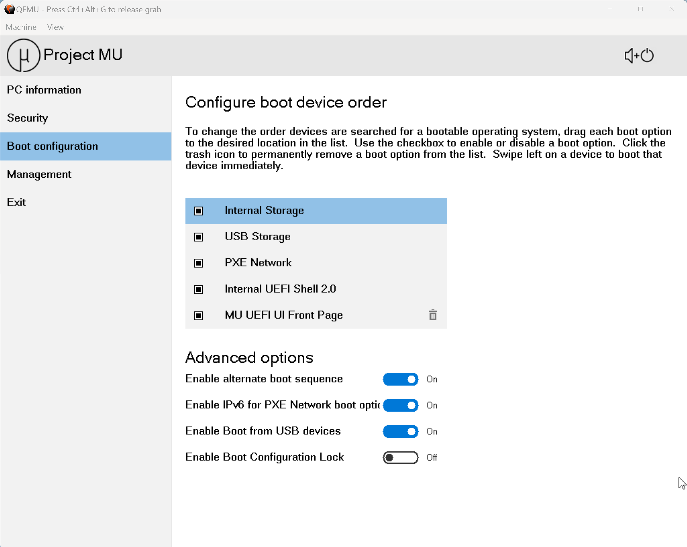
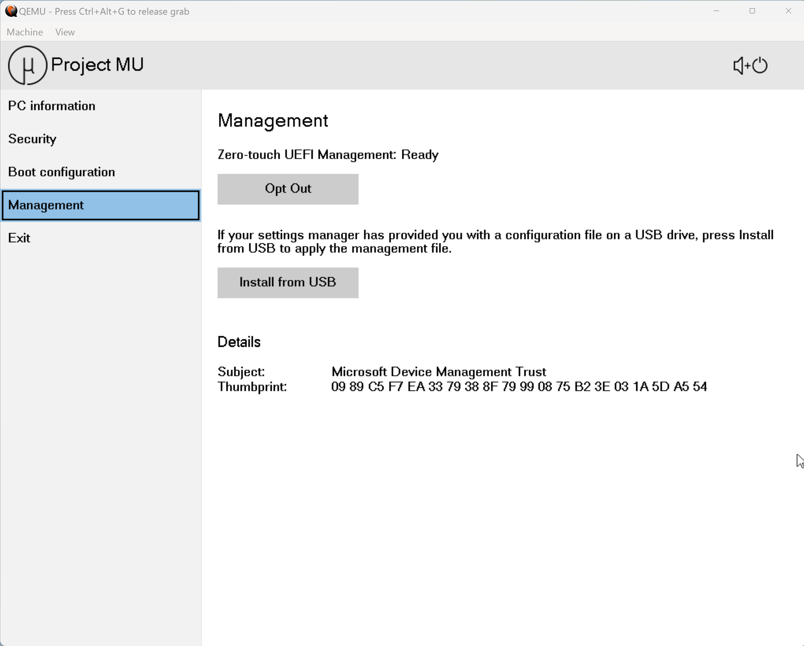
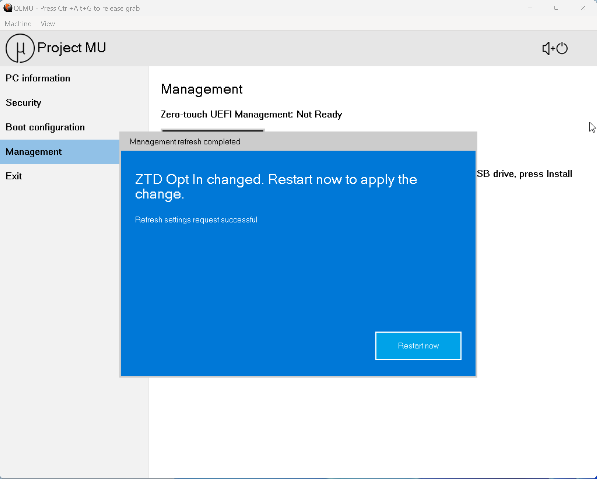
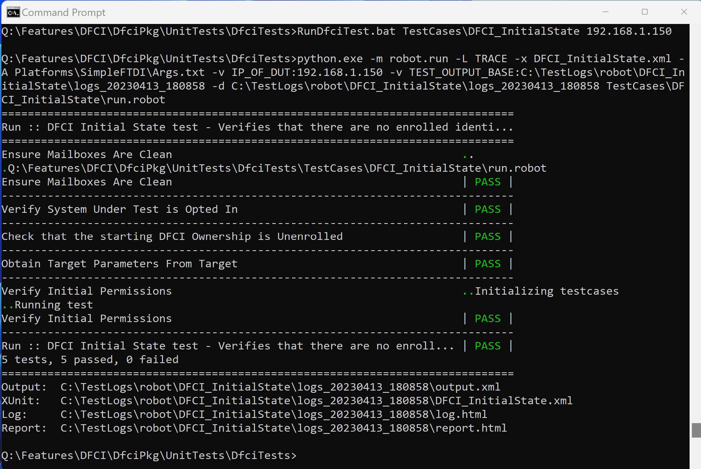

# Building and Running QemuQ35Pkg with DFCI

QemuQ35Pkg virtual machine environment is available at
[here](https://github.com/microsoft/mu_tiano_platforms.git).

This document describes how to build and Run a QemuQ35Pkg virtual device to
exercise the DFCI test cases.

## Getting started

You will need the following:

1. Knowledge that the sub directory DfciDutFiles is used for both the build and run scripts for
Q35, the emulated USB drives used to install windows, and setup the DFCI Test solution into the QemuQ35Pkg VM.
2. An install image for Windows 11 (available when you purchase a license for Windows 11).
    - Using the [Windows Media Creation Tool](https://support.microsoft.com/en-us/windows/create-installation-media-for-windows-99a58364-8c02-206f-aa6f-40c3b507420d),
create a USB storage device from your install media.
3. An upper end X64 desktop system that can dedicate three processor cores to the QemuQ35Pkg virtual device.
4. The HOST needs to be setup to run the DFCI test cases.
See [Setting up the Host](https://github.com/microsoft/mu_feature_dfci/blob/main/DfciPkg/UnitTests/DfciTests/readme.md#setting-up-the-host-system-with-the-refresh-from-network-server-running-in-a-container).

## Setting up QemuQ35Pkg to be the Device Under Test

In the following, drive letter Q will be used for the QemuQ35 virtual system, and the home directory
is the default.  That means, the git clone command below will create
C:\Users\<username>\mu_tiano_platforms,
and drive letter Q will be substituted for C:\Users\<username>\mu_tiano_platforms.

Clone mu_tiano_platforms:

    ```text
        git clone https://github.com/microsoft/mu_tiano_platforms.git
        cd mu_tiano_platforms
        subst Q: .
    ```

## Creating the necessary DfciDutFiles

The directory DfciDutFiles will be mounted in the Qemu35Pkg as a USB storage device.
This is the mechanism to transfer files into and out of the virtual machine environment.

Do the following:

    ```text
        Q:
        python -m pip install --upgrade -r pip-requirements.txt
        stuart_setup -c Platforms\QemuQ35Pkg\PlatformBuild.py
        stuart_update -c Platforms\QemuQ35Pkg\PlatformBuild.py
        cd DfciDutFiles
        BuildDfci.py
        \Features\DFCI\DfciPkg\UnitTests\DfciTests\DeviceUnderTest\CollectFilesForDut.cmd \DfciDutFiles\DfciSetup
    ```

Using the HOST system's Disk Management, create two VHD files:

    1. Using Action->Create VHD, create a 64GB VHD at Q:\DfciDutFiles\Windows.vhd.
    2. Detach the Windows.vhd.
    3. Using Action->Create VHD, create a 6GB VHD at Q:\DfciDutFiles\OsInstallFiles.vhd.
    4. Initialize the this disk with a GPT partition.
    5. Create a new Simple Volume using FAT32, and quick format the drive.
    6. Mount the new OsInstallFiles.vhd as some drive letter(eg V:).
    7. Mount the USB drive by the Windows Media Creation Tool (say drive D:).
    8. Copy the Windows USB storage device(D:) to the drive letter where you mounted the OsInstallFiles.vhd(V:):

        ```text
           xcopy D:\*.* V:\ /s
        ````

    9. Detach the OsInstallFiles.vhd

The OS install USB has to be mounted this way as the FAT32 code in QemuQ35 Pkg does not support
USB devices with files greater that are larger than 2GB.
Unfortunately, the Windows Media Creation tool creates a 3GB install file.
Mounting the VHD causes only the Windows FAT driver to look at the drive with no Qemu USB
emulation.
Mounting a USB drive directly, or through a sub directory, invokes Qemu USB emulation.

When you are done, DfciDutFiles should look like this:

    ```text
        Q:\DfciDutFiles>dir
         Volume in drive Q has no label.
         Volume Serial Number is 8241-1EA0

         Directory of Q:\DfciDutFiles

        04/07/2023  05:28 PM    <DIR>          .
        04/07/2023  05:28 PM    <DIR>          ..
        04/06/2023  05:36 PM               784 BuildDfci.py
        04/06/2023  04:04 PM    <DIR>          DfciSetup
        04/05/2023  02:35 PM     6,442,451,456 OsInstallFiles.vhd
        04/07/2023  05:26 PM             2,442 ReadMe.md
        04/06/2023  04:06 PM             2,424 RunDfci.py
        04/07/2023  10:36 AM    68,719,477,248 Windows.vhd
                       5 File(s) 75,161,934,354 bytes

        Q:\DfciDutFiles>
    ```

## QemuQ35Pkg firmware settings needed

Run:

    ```text
        RunDfci -f
    ```

You will be presented with a Microsoft Surface like firmware interface



The QemuQ35Pkg virtual system is used by Project Mu for various testing activities, and had
setting set a certain way for that test environment.
For DFCI testing, some of the hard coded defaults need to be changed before we install the OS.

Here are the keyboard shortcuts for the Microsoft Surface like FrontPage:

- The Selection is a black rectangle around an item.
- The Tab key moves the selection from one control to the next control.
- The shift-tab key moves the selection from one control to the previous control.
- The up and down arrow keys move the selection from from one element in a list to another.
- The left and right arrow keys change the state of a selected checkbox or switch.
- The Enter key with the selection on the an item in the left menu will navigate to that menu.
- The space-bar key will toggle a selected switch, or checkbox.
- The Enter key with the selection on a boot order entry will attempt to boot that boot order entry.
- The + key will move the selected boot order entry up.
- The - key will move the selected boot order entry down.
- The delete key will delete a selected boot order entry if the boot order entry may be deleted.
    A boot order entry may be deleted if it has a trash can symbol on the boot order entry.

Make the following changes:

1. Enable Secure Boot
    - Navigate to the Security Menu 
    - Tab to the Change configuration button, and press Enter 
    - Tab to the OK button, and press Enter 

2. Set the Boot order to match the following image
    

3. Set Management to Opted In
    - Navigate to Management 
    - Select Opt In 
    - Selected the Restart button, and press Enter 

To turn off the QemuQ35Pkg virtual system, just close the window.

## Install the OS to Windows.vhd

Run the QemuQ35Pkg virtual system by adding -i (Mount the OsInstallFiles.vhd as a USB drive)
and -a (boot to the alternate boot order (USB/Network/Storage) options.

    ```text
        RunDfci.py -i -a
    ```

Install Windows as you normally would.

At this point, let the Windows system update itself.
During some idle time, check Task Manager to see what is using the idle time.
Uninstall applications that are using a lot of CPU.
By uninstalling unnecessary application that are not needed for testing, performance of the QemuQ35Pkg
virtual device will be improved.

After you have finished the install of Windows, and uninstalling a few preinstalled applications,
do a normal OS Shutdown.  When the OS finally shuts down, the display window will close, and the
RunDfci.py command will return to the command prompt.

## Install the test framework onto the QemuQ35Pkg virtual system

Run the QemuQ35Pkg virtual system by adding -d (Mount the DfciDutFiles)

    ```text
        RunDfci -d
    ```

After booting into Windows, it is advisable to add a local user to this newly installed system.
Create it with no password, and set the Password Never Expires option.

Next, run NtwPlWiz.
You can follow the steps at
[Running NetPlWiz](https://answers.microsoft.com/en-us/windows/forum/all/how-to-login-automatically-to-windows-11/c0e9301e-392e-445a-a5cb-f44d00289715).

Finally, restart the system and make sure the new user logs in automatically.

Once the system is booting with the automatically logged on user, look for the D: drive.
It should list the files that are in the DfciDutFiles.
Run the command:

    ```text
        D:\DfciSetup\SetupDUT.cmd
    ```

This will download and install Python, robotframework, robotremoteserver, and pypiwin32.
In addition, the SetupDUT command will update the firewall for the robot framework testing, and a make a couple of
configuration changes to Windows for a better test experience.

## Testing the QemuQ35Pkg Device Under Test

The last way to start the QemQ35Pkg virtual system is with no extra parameters.
Just run:

    ```text
        RunDfci
    ```

No parameter means just boot the QemuQ35Pkg virtual system.
This is the normal way to boot to Windows and test DFCI.

With QemuQ35Pkg virtual system up and running, you should see the python remote server window.

## Initial testing

On the HOST system,

    ```text
        cd DfciPkg\UnitTest\DfciTest
        RunDfciTest Testcases\DFCI_InitialState <host-system-ipaddress>
    ```

You should see: 

## Help! Things are messed up

So, you made some changes in the QemuQ35Pkg firmware that somehow broke DFCI.
You enrolled the system, but lost the certificate, so you cannot unenroll QemuQ35Pkg.

For real work machines, this too can happen.
In QemuQ35Pkg, you are not broken.
In DfciDutFiles, the RunDfci.py command created a file named DFCI_DUT_VARS.fd.
This is the variable store for the QemuQ35Pkg DFCI virtual system.
To erase the variable store, and start over, just erase DfciDutFiles\DFCI_DUT_VARS.fd.
The next time you RunDfci.py, DFCI_DUT_VARS.fd will be created.

In your real work OEM device, you should have a secure method to enter Manufacturing Mode.
Project Mu can help your platform here, too, as it has the support for secure enablement of
features like Manufacturing mode.
This package is called MfciPkg.
You can find out more about MfciPkg [here](https://github.com/microsoft/mu_plus/tree/release/202208/MfciPkg).
