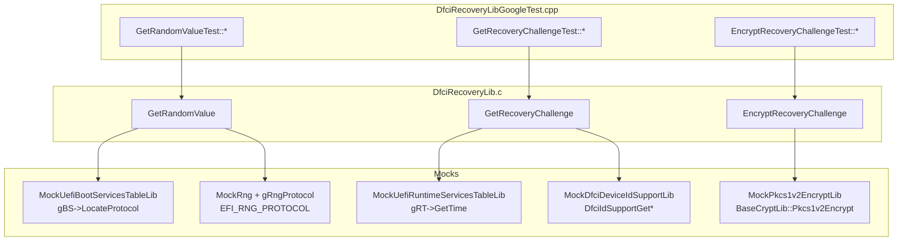

# DfciRecoveryLib GoogleTest

Host-based GoogleTest unit tests for `DfciPkg/Library/DfciRecoveryLib`.

This is an **implementation test**: it compiles the CUT's `.c` file
directly so that the file-scope `GetRandomValue ()` helper and the
file-scope `mSecureRngAlgorithms[]` table participate in the coverage.

## What is being tested

| Public API                  | Covered behaviors                                                                       |
| --------------------------- | --------------------------------------------------------------------------------------- |
| `GetRandomValue`            | NULL/zero inputs, LocateProtocol failure, first-algorithm success, fall-through to second algorithm, all-algorithms-unsupported, hard RNG error |
| `GetRecoveryChallenge`      | NULL challenge pointer, `gRT->GetTime` failure, happy path with deterministic time + RNG + ID lookups, ID-lookup failure                       |
| `EncryptRecoveryChallenge`  | Each NULL parameter, ExtraSeed RNG failure, `Pkcs1v2Encrypt` returning FALSE, happy path                                                       |

## Test categories satisfied

| Category                              | Notes                                                                                                                                                                |
| ------------------------------------- | -------------------------------------------------------------------------------------------------------------------------------------------------------------------- |
| Happy path                            | `HappyPathPopulatesChallenge`, `HappyPathReturnsSuccessAndForwardsBuffers`                                                                                           |
| NULL / empty inputs                   | `NullOutputReturnsInvalidParameter`, `ZeroLengthReturnsInvalidParameter`, `NullChallengePointerReturnsInvalidParameter`, the four `Null*ReturnsInvalidParameter` tests |
| Boundary values                       | Algorithm-table walk - first hit, mid-list hit, full exhaustion                                                                                                      |
| Error injection                       | LocateProtocol/GetRng returning EFI_NOT_FOUND, EFI_UNSUPPORTED, EFI_DEVICE_ERROR; `gRT->GetTime` returning EFI_DEVICE_ERROR; `Pkcs1v2Encrypt` returning FALSE         |
| `ASSERT()` triggers (DEBUG)           | `LocateProtocolFailureReturnsErrorAndAsserts`, `AllAlgorithmsUnsupportedReturnsNotFoundAndAsserts`, `NonUnsupportedRngErrorPropagatesAndAsserts`, `SeedRngFailurePropagatesAndAsserts` - guarded by `SKIP_IF_ASSERT_DISABLED()` |

## Categories intentionally NOT covered

* **AllocatePool failure for `GetRecoveryChallenge`.** The host-build
  `MemoryAllocationLib` (`MemoryAllocationLibPosix`) is not gMock-able;
  there is no clean way to force a `malloc()` failure deterministically.
  This is a real, unwitnessed contract of the CUT (EFI_OUT_OF_RESOURCES
  return). A future test could swap the library class to a custom
  pool-mock to cover it.
* **`GetRecoveryChallenge` post-allocation `GetRandomValue` failure.**
  In that path the CUT triggers an `ASSERT()` inside `GetRandomValue ()`
  before its own cleanup block runs, leaking the just-allocated
  challenge buffer. Address Sanitizer / LSan would surface the leak as
  a test failure. The omission is intentional and documented in the
  `.cpp` near the test class.
* **Adversarial / oversize inputs** to `EncryptRecoveryChallenge`. The
  CUT's contract for large `ChallengeSize` and large `PublicKeySize` is
  enforced inside `Pkcs1v2Encrypt`; that boundary belongs to the
  CryptoPkg unit tests, not here.

## Layout

```text
DfciPkg/Library/DfciRecoveryLib/
   DfciRecoveryLib.c                               <- CUT
   DfciRecoveryLib.inf
   GoogleTest/
      DfciRecoveryLibGoogleTest.inf                <- HOST_APPLICATION
      DfciRecoveryLibGoogleTest.cpp                <- test cases + main()
      MockDfciRecoveryExternals.h                  <- local mocks
      MockDfciRecoveryExternals.cpp
      ReadMe.md
DfciPkg/Test/
   DfciPkgHostTest.dsc                             <- registers the test
```

## Linkage diagram



## How to build and run

```pwsh
# Build + run (NOOPT host build, AddressSanitizer ON by default):
stuart_ci_build -c .pytool/CISettings.py -p DfciPkg -t NOOPT

# Iterate on this single test only:
stuart_ci_build -c .pytool/CISettings.py -p DfciPkg -t NOOPT `
  BUILDMODULE=DfciPkg/Library/DfciRecoveryLib/GoogleTest/DfciRecoveryLibGoogleTest.inf

# Coverage:
stuart_ci_build -c .pytool/CISettings.py -p DfciPkg -t NOOPT CODE_COVERAGE=TRUE
```

Built executable lands at:

```text
Build/DfciPkg/HostTest/NOOPT_<Toolchain>/<Arch>/DfciRecoveryLibGoogleTest.exe
```

Expected runtime is well under one second.

## ASSERT / Sanitizer policy

* Tests using `EXPECT_ANY_THROW` rely on `ASSERT()` being enabled. The
  DSC registration block intentionally **does not** override
  `PcdDebugPropertyMask`, and every such test guards itself with
  `SKIP_IF_ASSERT_DISABLED()` so a future override would degrade
  gracefully to a skip rather than a false failure.
* No test currently uses `EXPECT_DEATH` (no ASan-specific repro is
  expected from this library).

## Test → CUT mapping

| Test case                                              | Targets                                                |
| ------------------------------------------------------ | ------------------------------------------------------ |
| `GetRandomValueTest.NullOutputReturnsInvalidParameter`           | `GetRandomValue` NULL guard                            |
| `GetRandomValueTest.ZeroLengthReturnsInvalidParameter`           | `GetRandomValue` zero-length guard                     |
| `GetRandomValueTest.LocateProtocolFailureReturnsErrorAndAsserts` | `GetRandomValue` LocateProtocol failure + ASSERT       |
| `GetRandomValueTest.FirstAlgorithmSucceedsReturnsSuccess`        | Happy path of algorithm walk                           |
| `GetRandomValueTest.FirstAlgorithmUnsupportedSecondSucceeds`     | Continuation through EFI_UNSUPPORTED                   |
| `GetRandomValueTest.AllAlgorithmsUnsupportedReturnsNotFoundAndAsserts` | Full table walk + EFI_NOT_FOUND + ASSERT         |
| `GetRandomValueTest.NonUnsupportedRngErrorPropagatesAndAsserts`  | Hard error short-circuit + ASSERT                      |
| `GetRecoveryChallengeTest.NullChallengePointerReturnsInvalidParameter` | NULL guard                                       |
| `GetRecoveryChallengeTest.GetTimeFailureClearsChallenge`         | GetTime failure cleanup path                           |
| `GetRecoveryChallengeTest.HappyPathPopulatesChallenge`           | Full happy path - timestamp, nonce, MultiString, size  |
| `GetRecoveryChallengeTest.IdLookupFailureStillReturnsChallengeBuffer` | Documented quirk: ID failure -> non-NULL Challenge |
| `EncryptRecoveryChallengeTest.NullChallengeReturnsInvalidParameter`       | NULL Challenge guard                          |
| `EncryptRecoveryChallengeTest.NullPublicKeyReturnsInvalidParameter`       | NULL PublicKey guard                          |
| `EncryptRecoveryChallengeTest.NullEncryptedDataReturnsInvalidParameter`   | NULL EncryptedData guard                      |
| `EncryptRecoveryChallengeTest.NullEncryptedDataSizeReturnsInvalidParameter` | NULL EncryptedDataSize guard                |
| `EncryptRecoveryChallengeTest.SeedRngFailurePropagatesAndAsserts`         | Extra-seed RNG failure + ASSERT               |
| `EncryptRecoveryChallengeTest.Pkcs1v2FalseReturnsAborted`                 | Encryption failure -> EFI_ABORTED             |
| `EncryptRecoveryChallengeTest.HappyPathReturnsSuccessAndForwardsBuffers`  | Happy path, buffer forwarding                 |
