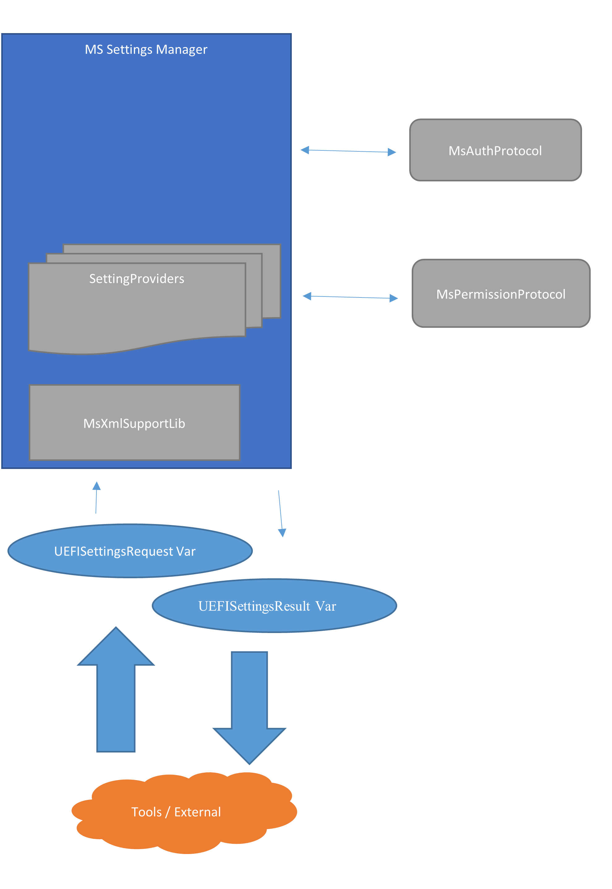

# Microsoft Settings Manager Implementation details

## SettingsManager.h

- Internal header file for internal definitions.
  - Linked List for providers
  - Internal Function prototypes
- Common Header file includes

## SettingsManagerProvider.c

- Provider List implementation
  - Register
  - Find by ID
  - Debug Print
    - Convert providers into ASCII

## SettingsManagerTransportXML.c

- Implementation that supports getting XML settings input (config
    packets) from variables
- Validating Xml input
- Processing incoming settings and applying using registered setting
    providers.
- Creating Result XML variable

## SettingsManagerDxe.c

- C code to handle Dxe specific behavior.
  - Entry point
  - Install Dxe Protocol
  - Events
  - Get other Dxe Protocols
    - MsAuth
    - MsPolicy

## SettingsManagerDxe.inf

- DxeDriver INF file

## MsSettingsManagerVariables.h - PUBLIC HEADER FILE

MsSurfaceModulePkg/Include/Guid/MsSettingsManagerVariables.h

- Var names, sizes, namespace guids, and variable format.

## Error Codes

EFI_ABORTED : System failure or logic error. This type of thing should
never happen unless code is bad or system is having major issues. Memory
allocations fail, functions called with incorrect parameters, etc.

EFI_INCOMPATIBLE_VERSION: Variable structure is not understood. Basic
checking not including signature validation. This is checking of
version, header, size, etc.

EFI_INVALID_PARAMETER: Can't even record status or state because invalid
functional parameters.

EFI_NOT_FOUND: Variable not found. Not really an error.

EFI_BAD_BUFFER_SIZE: Variable is larger than max size or the
different sizes in the variable and structures didn't match.

EFI_SECURITY_VIOLATION: Actual signature validation failed.

EFI_NO_MAPPING : Failed to process XML
